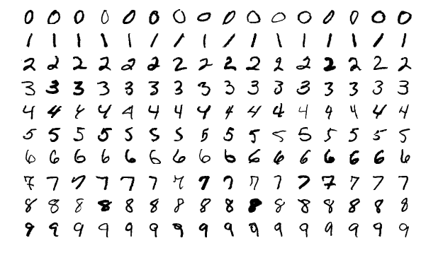

# CNN for digit recognition

This is a Classification problem. The netwrok will try to predict the true label attached to the input image with which it is feeded. The dataset used was the [MNIST](http://yann.lecun.com/exdb/mnist/) and we reached an accuracy of 99.33%.

## About the data set used
The MNIST database (Modified National Institute of Standards and Technology database) of handwritten digits consists of a training set of 60,000 examples, and a test set of 10,000 examples. It is a subset of a larger set available from NIST. Additionally, the black and white images from NIST were size-normalized and centered to fit into a 28x28 pixel bounding box and anti-aliased, which introduced grayscale levels.

  

## Architecture

The netwrok is composed by 4 convolutional layers. The first two convolutional layers are composed by 28 nodes each, while the last two by 14 nodes each. In between these layer we make use of the maxpooling and dropout operations. After this layers group, the output gets flattened out, and three fully connected layers for the final classification network. The final fully connected layer is made of 10 nodes, each one corresponding to a digit from 0 to 9. Below we can see two representations of the same network. 

## Requirements

- Python 3.5+
- Scikit-Learn (latest version)
- Numpy (+ mkl for Windows)
- Matplotlib

### Accuracy using Machine Learning Algorithms:

- K Nearest Neighbors: 96.67%

- SVM: 97.91%

- Random Forest Classifier: 96.82%

### Accuracy using Deep Neural Networks:

- Three Layer Convolutional Neural Network using Tensorflow: 99.33%

- Three Layer Convolutional Neural Network using Keras and Theano: 98.75%

